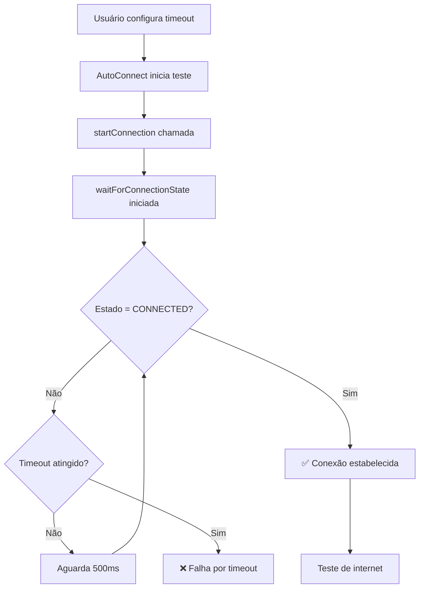

# Timeout de Conexão no AutoConnect - Análise Detalhada

## 🎯 **Como o Timeout de Conexão Funciona**

### 📊 **Fluxo de Execução**



### 🔧 **Implementação Atual**

#### **1. Configuração do Usuário**
```typescript
// Valores configuráveis na UI
interface AutoConnectConfig {
  connectionTimeout: number; // 3000ms - 30000ms (3s - 30s)
  // Padrão: 8000ms (8 segundos)
}
```

#### **2. Função de Controle**
```typescript
async function waitForConnectionState(targetState: string, timeout: number, cancelRef?) {
  const start = Date.now();                           // ⏰ Marca início
  
  while (Date.now() - start < timeout) {              // 🔄 Loop até timeout
    if (cancelRef?.current?.cancelled) return false;  // 🛑 Verificação cancelamento
    
    const state = getConnectionState();               // 📡 Consulta estado VPN
    if (state === targetState) return true;          // ✅ Sucesso!
    
    await new Promise(res => setTimeout(res, 500));   // ⏳ Aguarda 500ms
  }
  
  return false;                                      // ❌ Timeout atingido
}
```

#### **3. Uso no AutoConnect**
```typescript
// Para cada configuração testada:
try {
  startConnection();                                              // 🚀 Inicia VPN
  
  const connected = await waitForConnectionState(
    'CONNECTED',                                                  // 🎯 Estado alvo
    autoConnectConfig.connectionTimeout,                         // ⏱️ Timeout configurado
    cancelRef                                                    // 🛑 Ref de cancelamento
  );
  
  if (connected) {
    // ✅ Conexão estabelecida, testa internet
    const internetOk = await testInternet(autoConnectConfig.fetchTimeout);
  } else {
    // ❌ Timeout ou falha na conexão
    onTestResult?.(config.name, false, 'Falha na conexão VPN');
  }
} catch (error) {
  // 🚨 Erro durante processo
}
```

### ⚙️ **Valores e Configurações**

#### **Range de Valores**
- **Mínimo**: 3000ms (3 segundos)
- **Máximo**: 30000ms (30 segundos)  
- **Padrão**: 8000ms (8 segundos)
- **Incremento**: 1000ms (1 segundo)

#### **Controles na UI**
```tsx
// Range slider + botões +/- + input direto
<input
  type="range"
  min="3000"
  max="15000"
  step="1000"
  value={autoConnectConfig.connectionTimeout}
  onChange={(e) => updateConfig({ connectionTimeout: parseInt(e.target.value) })}
/>
```

### 🎪 **Comportamento em Diferentes Cenários**

#### **📈 Timeout Baixo (3-5s)**
- ✅ **Vantagem**: Testes mais rápidos
- ❌ **Desvantagem**: Pode não dar tempo para conexões lentas
- 🎯 **Ideal para**: Conexões rápidas e estáveis

#### **⚖️ Timeout Médio (6-10s)**
- ✅ **Balanceado**: Bom para maioria dos casos
- 🎯 **Ideal para**: Uso geral e redes normais
- 📊 **Padrão**: 8 segundos

#### **📉 Timeout Alto (15-30s)**
- ✅ **Vantagem**: Funciona com conexões muito lentas
- ❌ **Desvantagem**: Testes demoram muito
- 🎯 **Ideal para**: Redes instáveis ou saturadas

### 🔍 **Otimizações Implementadas**

#### **1. Timeout Obrigatório**
```typescript
// ✅ ANTES: timeout = 10000 (valor padrão fixo)
// ✅ DEPOIS: timeout: number (obrigatório, vem da config)
async function waitForConnectionState(targetState: string, timeout: number, cancelRef?)
```

#### **2. Polling Eficiente**
- **Intervalo**: 500ms entre verificações
- **Responsivo**: Cancela imediatamente se solicitado
- **Preciso**: Controle exato do tempo decorrido

#### **3. Feedback Detalhado**
```typescript
// Mensagens específicas para cada situação
if (connected) {
  // Teste de internet
} else {
  onTestResult?.(config.name, false, 'Falha na conexão VPN');  // ❌ Timeout
}
```

### 📊 **Métricas e Monitoramento**

#### **Logs Gerados**
1. **Início**: "Conectando..." (com ícone de loading)
2. **Progresso**: Cronômetro em tempo real
3. **Sucesso**: "Conexão bem-sucedida!" + duração
4. **Falha**: "Falha na conexão VPN" + duração até timeout

#### **Dados Coletados**
- ⏱️ **Duração real** de cada tentativa
- 📊 **Taxa de sucesso** por timeout configurado
- 🎯 **Configurações** que mais funcionam

### 🚀 **Recomendações de Uso**

#### **Para Conexões Rápidas (Fibra/4G)**
- **Timeout**: 5-8 segundos
- **Resultado**: Testes rápidos e eficientes

#### **Para Conexões Normais (ADSL/WiFi)**
- **Timeout**: 8-12 segundos  
- **Resultado**: Balanceado e confiável

#### **Para Conexões Lentas (3G/Satélite)**
- **Timeout**: 15-25 segundos
- **Resultado**: Maior chance de sucesso

### 🎉 **Resultado**

O **timeout de conexão** é usado de forma **inteligente e configurável**:

1. **🎛️ Controle total** pelo usuário (3s-30s)
2. **⏱️ Aplicação precisa** na lógica de conexão
3. **📊 Feedback detalhado** com durações reais
4. **🎯 Otimizado** para diferentes tipos de rede
5. **🛑 Cancelamento** instantâneo quando necessário

A implementação garante que o valor configurado pelo usuário seja **sempre respeitado** e aplicado corretamente no processo de conexão! ✅
